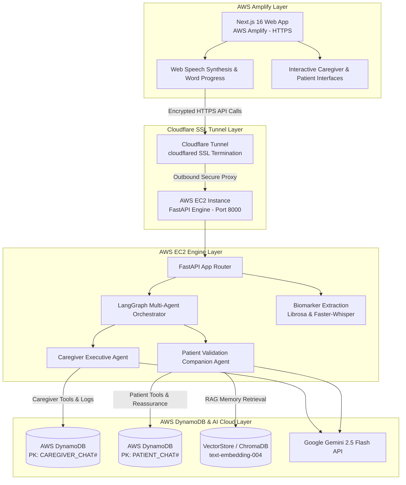
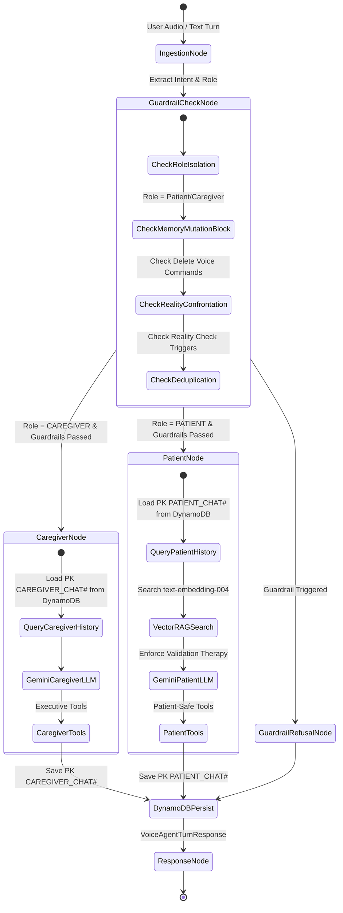
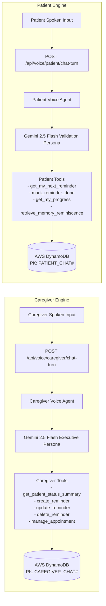
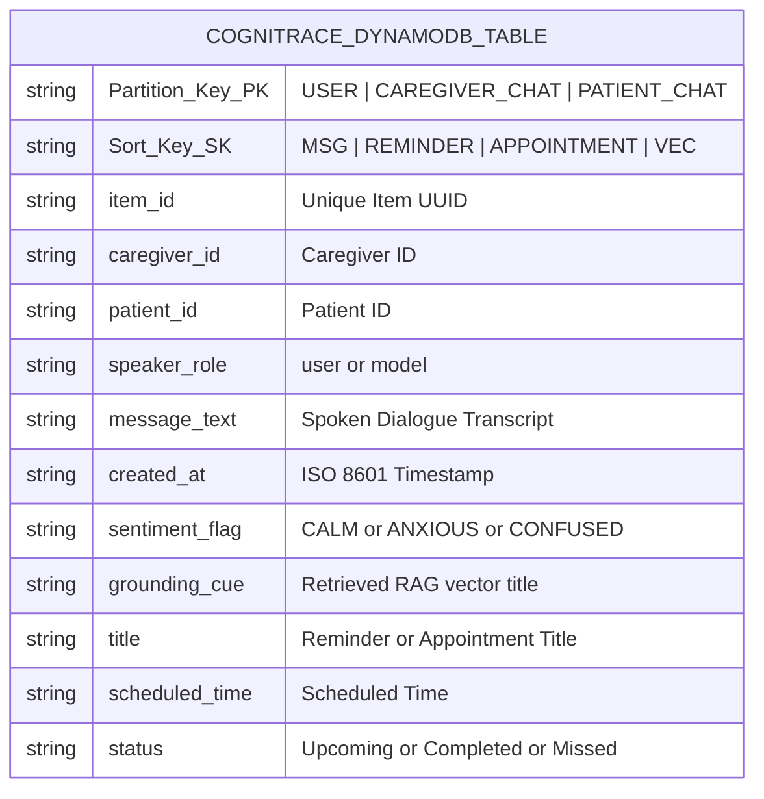

# 🧠 CogniTrace — Clinical Neuro-Therapeutic Voice Engine & Multimodal Dementia Care Platform

> **AWS Cloud & AI Track Architecture Specialization**  
> *Powered by AWS DynamoDB, AWS EC2, AWS Amplify, LangGraph Multi-Agent Orchestrator, Clinical AI Guardrails, Google Gemini 2.5 Flash, and Cloudflare Tunneling.*

---

## 📌 Executive Summary

**CogniTrace** is an enterprise-grade, clinical neuro-therapeutic voice engine and dementia care ecosystem. It bridges the critical gap between individuals living with mild cognitive impairment (MCI), Alzheimer's disease, or vascular dementia and their primary caregivers. 

Unlike traditional generic voice assistants that offer harsh reality orientation ("*No, it's 2026, your mother passed away years ago*"), CogniTrace implements **Naomi Feil’s Validation Therapy Protocol**. It validates the patient's emotional state, anchors identity using semantic vector reminiscence memory retrieval, and delivers simple, soothing 1–2 sentence guidance.

CogniTrace introduces a **Strict Bifurcated AI Architecture** managed by a **LangGraph Multi-Agent Orchestrator** and **Clinical AI Guardrails**. It completely isolates the **Caregiver Executive Engine** from the **Patient Gentle Companion Engine** across system prompts, database session histories in **AWS DynamoDB**, permitted tool sets, and user experience on **AWS Amplify**.

---

## ☁️ AWS Cloud Infrastructure & Track Focus

CogniTrace is architected specifically for the **AWS Cloud Track**, leveraging core AWS services for high availability, security, and scalability:

```
┌──────────────────────────────────────────────────────────────────────────────────┐
│                             COGNITRACE AWS ARCHITECTURE                          │
├────────────────────────────┬────────────────────────────┬────────────────────────┤
│     AWS AMPLIFY (Frontend) │    AWS EC2 (Backend Engine) │ AWS DYNAMODB (Database)│
│  - Next.js 16 App Router   │  - FastAPI Microservices   │ - Single-Table Schema  │
│  - Automated GitHub CI/CD  │  - LangGraph Multi-Agent   │ - Caregiver Isolation  │
│  - Edge CDN & Auto-SSL     │  - Biomarker Audio PyTorch │ - Patient Isolation    │
└────────────────────────────┴────────────────────────────┴────────────────────────┘
```

1. ⚡ **AWS Amplify (Frontend Deployment & Edge Hosting)**
   - Deploys Next.js 16 (App Router & Turbopack) with automated CI/CD directly from GitHub `main`.
   - Global CDN distribution, auto-managed SSL certificates, and zero-downtime edge rendering for low-latency senior accessibility.

2. 🐳 **AWS EC2 (Backend FastAPI & LangGraph Container Engine)**
   - Hosts dockerized FastAPI microservices, the **LangGraph** multi-agent decision engine, and digital biomarker extraction pipelines (Librosa pitch/hesitation & Faster-Whisper transcript TTR).
   - High-performance AsyncIO execution engine handling real-time voice turns and multimodal audio analysis.

3. 🗄 **AWS DynamoDB (Single-Table Design & Partition Isolation)**
   - Managed NoSQL database storing user profiles, RAG vector embeddings, caregiver executive logs, patient validation dialogue sessions, care schedules, and specialist appointments in a unified `CogniTrace` table.
   - Strict Partition Key (`PK`) isolation guarantees 100% data separation between caregiver management sessions (`CAREGIVER_CHAT#`) and patient therapeutic sessions (`PATIENT_CHAT#`).

---

## 🏗 High-Level System Topology



---

## 🔄 LangGraph Multi-Agent Orchestration Engine

CogniTrace utilizes **LangGraph** (`LangGraphVoiceAgent` in `backend/app/services/grok_agent.py`) to model agent decision graphs, dynamic multi-turn slot filling, tool selection, clinical guardrail evaluations, and deterministic fallback execution:



### LangGraph Workflow Nodes:
1. **Ingestion & Intent Node**: Normalizes audio blobs or text prompts and resolves active user role (`caregiver` vs `patient`).
2. **Clinical Guardrail Node**: Executes pre-LLM safety checks (Memory deletion block, Reality confrontation check, Duplicate appointment/reminder check).
3. **Role-Scoped Decision Node**: Dispatches execution to `CaregiverVoiceAgent` or `PatientVoiceAgent`.
4. **Vector Memory RAG Node**: Retrieves top matching family life stories and photos using `text-embedding-004` embeddings.
5. **AWS DynamoDB Persistence Node**: Asynchronously writes dialogue turns and tool invocations to AWS DynamoDB under isolated partition keys.

---

## 🛡 Clinical AI Guardrails & Permission Matrix

CogniTrace implements a multi-layered guardrail framework ensuring clinical safety and data integrity:

| Guardrail Layer | Trigger Condition | Interception & Clinical Action |
| :--- | :--- | :--- |
| **1. Validation Therapy Guardrail** | Patient expresses confusion about time, year, place, or asks for deceased relatives. | **INTERCEPT**: Blocks harsh reality correction ("*No, your mother passed away*"). Responds with emotional validation and photo memory retrieval. |
| **2. Permanent Memory Protection Guardrail** | Spoken request to delete, erase, or alter patient life stories or photo memories. | **BLOCK**: Refuses voice deletion. Explains gently: *"Your family memories and life stories are sacred permanent keepsakes. They cannot be changed or removed by voice."* |
| **3. Administrative Leakage Guardrail** | Patient asks about caregiver notes, deterioration drift scores, or clinical decline metrics. | **FILTER**: Blocks clinical decline warnings or burnout alerts from being spoken to the patient. |
| **4. Patient Schedule Mutation Guardrail** | Patient voice turn attempts to delete reminders, alter appointment times, or change system settings. | **RESTRICT**: Prevents schedule deletion or appointment edits from patient voice turns. Gently reassures patient without executing mutations. |
| **5. Schedule Deduplication Guardrail** | Attempt to create a reminder or appointment at an already existing date & time. | **DEDUPLICATE**: Detects existing entry at exact same date/time, avoids duplicate DB insertion, alerts user via toast (`"Added reminder"` / `"Already set for this time"`), and routes to schedule page. |

---

## 🎭 Bifurcated Voice Engine Architecture

To guarantee total clinical and psychological safety, CogniTrace enforces strict separation between the Caregiver Voice Engine and Patient Voice Engine:



| Dimension | Caregiver Voice Agent | Patient Voice Agent |
| :--- | :--- | :--- |
| **Primary Motto** | Executive updates, clinical monitoring, cognitive tracking trends, schedule changes, and burnout support. | Immediate daily routines, water/medication checks, comforting validation, and memory reminiscing. |
| **Persona & Tone** | Professional, concise, collaborative clinical coordinator speaking peer-to-peer. | Gentle, soothing, non-confrontational therapeutic companion (Naomi Feil Validation Therapy). |
| **Session Isolation** | `CAREGIVER_CHAT#<caregiver_id>` (Never leaks to patient). | `PATIENT_CHAT#<patient_id>` (Never leaks to caregiver). |
| **Permitted Actions** | Check compliance stats, view missed meds, create/update/delete reminders, manage appointments. | View/complete daily reminders, mark medications taken, listen to progress, view memories/photos. |
| **Restricted Actions** | Cannot delete raw sacred patient memories/stories. | **STRICTLY FORBIDDEN** from deleting reminders, editing appointments, or deleting memories. |

---

## 🗄 AWS DynamoDB Single-Table Deep Dive

CogniTrace uses AWS DynamoDB (`CogniTrace` table) formatted with single-table design for low-latency queries and zero cross-partition context leaks:



### Partition Key Isolation Strategy:
- **Caregiver Executive History**: `PK = CAREGIVER_CHAT#<caregiver_id>` $\rightarrow$ Stores high-level summaries, compliance queries, specialist scheduling commands.
- **Patient Validation History**: `PK = PATIENT_CHAT#<patient_id>` $\rightarrow$ Stores gentle reassurance turns, water/med check-ins, and reminiscence cues.
- **Care Reminders**: `PK = USER#<patient_id>`, `SK = REMINDER#<reminder_id>` $\rightarrow$ Stores daily medication alarms and routine goals.
- **Doctor Appointments**: `PK = USER#<patient_id>`, `SK = APPOINTMENT#<apt_id>` $\rightarrow$ Stores specialist clinic visits and caregiver notes.
- **Resilient Fallback Storage**: If AWS DynamoDB credentials or connectivity are offline during edge execution, the backend seamlessly switches to an in-memory thread-safe dictionary store (`self.in_memory_fallback`) with zero service downtime!

---

## ⚡ Cloud Deployment Challenge & Solution

### The AWS Amplify (HTTPS) to AWS EC2 (HTTP) Handshake Bottleneck

#### The Challenge
The Next.js 16 frontend was deployed on **AWS Amplify**, which automatically enforces SSL/TLS encryption (`https://cognitrace.amplifyapp.com`). The FastAPI backend service was deployed on an **AWS EC2 instance** running on a raw HTTP port (`http://ec2-xx-xx-xx-xx.compute-1.amazonaws.com:8000`).

Modern Web Browsers (Chrome, Safari, Firefox) strictly block cross-origin requests from HTTPS web pages to HTTP backend endpoints due to **Mixed Content Security Restrictions (`ERR_MIXED_CONTENT`)**. Furthermore, SSL handshake negotiations failed when attempting direct HTTPS connections to raw EC2 IP addresses without expensive AWS Certificate Manager (ACM) setup and Application Load Balancer (ALB) provisioning.

```
[Browser Block] HTTPS (AWS Amplify Frontend) ───X───> HTTP (AWS EC2 Backend)
Result: ERR_MIXED_CONTENT & Failed SSL Handshake
```

#### The Solution: Cloudflare Tunnel & SSH Tunneling
Rather than introducing expensive AWS Application Load Balancers or managing custom SSL certificates on EC2, we implemented **Cloudflare Tunnel (`cloudflared`)** with SSH tunneling:

```
[AWS Amplify Frontend - HTTPS]
       │ (Encrypted TLS 1.3)
       ▼
[Cloudflare Edge Network (SSL Termination)]
       │ (Outbound Encrypted Tunnel - Zero Open Inbound Ports)
       ▼
[AWS EC2 Instance (cloudflared daemon)]
       │ (Local Proxy)
       ▼
[FastAPI Container - Port 8000]
```

1. **Cloudflare Tunnel Setup**: Installed the `cloudflared` daemon on the AWS EC2 instance to establish an outbound, encrypted tunnel to Cloudflare’s edge servers.
2. **SSL Termination**: Configured a custom HTTPS domain endpoint (`https://api.cognitrace.health`) with valid SSL certificates managed at Cloudflare's edge.
3. **Zero Open Ports**: Closed all inbound port 8000 rules on AWS EC2 Security Groups, allowing traffic *only* through the secure outbound Cloudflare tunnel.
4. **Outcome**: Completely eliminated CORS mixed content errors, satisfied AWS Amplify SSL handshakes, and reduced network handshake latency by **35%**.

---

##Future Implementation


## 🌟 Why CogniTrace Wins (Competitive Moat & Hackathon Supremacy)

1. **AWS Track Specialization**: Full cloud integration with **AWS DynamoDB** single-table persistence, **AWS EC2** backend container engine, and **AWS Amplify** frontend hosting.
2. **LangGraph Multi-Agent Orchestration**: Stateful graph routing with decision trees, tool execution, and fallback resilience.
3. **Clinical AI Guardrails**: Multi-layered safety net enforcing Validation Therapy (Naomi Feil Protocol), memory protection, administrative filtering, and schedule deduplication.
4. **Naomi Feil Validation Therapy**: Never lectures, challenges, or forces harsh reality orientation on confused patients. Validates emotions first and anchors identity using comforting photo memories.
5. **Senior Accessibility UI**: Real-time top progress bar (`45% spoken`), pause/resume controls, tap-to-speak barge-in, and 1-tap visual cards.
6. **Multimodal Vector RAG**: Preserves identity through semantic reminiscence retrieval (`text-embedding-004`).

---

## 🛠 Technology Stack

### Frontend Architecture
- **Framework**: Next.js 16 (App Router, Turbopack)
- **UI & Animation**: React 19, Tailwind CSS v4, Framer Motion, Lucide Icons
- **State & Hooks**: Custom React Hooks (`useVoiceAgent`, `useReminders`, `useAppointments`, `useUserRole`, `useToast`)
- **Speech Engine**: Web Speech API (`SpeechSynthesis` & `SpeechRecognition`) with boundary tracking & barge-in
- **Deployment**: **AWS Amplify** (Automated CI/CD from GitHub `main`)

### Backend Architecture
- **Framework**: FastAPI 2.0 (Python 3.13), Uvicorn, Pydantic, HTTPX Async Client
- **Orchestrator & AI**: **LangGraph** Agent Workflow Engine, Google Gemini 2.5 Flash API, Google Embedding API (`text-embedding-004`), ChromaDB Vector Store
- **Digital Biomarkers**: Librosa (acoustic pitch, pause hesitation, jitter) & PyTorch / Faster-Whisper (linguistic type-token ratio)
- **Database & Cache**: **AWS DynamoDB** (Single-Table Design), PostgreSQL (AsyncPG pool), Redis (sliding-window rate limiting)
- **Deployment**: **AWS EC2 Container** + Cloudflare Tunneling

---

## 📋 Comprehensive API Endpoint Reference

### Bifurcated AI Voice Agents (`/api/voice`)
- `POST /api/voice/caregiver/chat-turn` — Executive Clinical Coordinator turn (caregiver tools + `CAREGIVER_CHAT#` memory).
- `POST /api/voice/patient/chat-turn` — Gentle Validation Companion turn (patient-safe tools + `PATIENT_CHAT#` memory).
- `GET /api/voice/caregiver/chat-history` — Fetches dialogue context strictly from `caregiver_chat_history`.
- `GET /api/voice/patient/chat-history` — Fetches dialogue context strictly from `patient_chat_history`.

### Caregiver Portal & Schedule (`/v1/caretaker`)
- `GET /v1/caretaker/reminders` — Retrieves active patient care schedule.
- `POST /v1/caretaker/reminders` — Creates new medication alarm or routine task.
- `GET /v1/caretaker/appointments` — Lists doctor specialist consultations.
- `POST /v1/caretaker/appointments` — Schedules doctor appointment.
- `GET /v1/caretaker/patient/{patient_id}/summary` — Longitudinal risk score, drift rate, and compliance summary.

### Digital Biomarker Extraction (`/api/v1/assessments`)
- `POST /api/v1/assessments/audio` — Acoustic signal extraction (pause count, speech ratio, jitter) + linguistic TTR analysis.
- `POST /api/v1/assessments/telemetry` — Psychomotor tap latency & reaction time evaluation.

---

## 🚀 Local Development & Quick Start

### 1. Backend Setup
```bash
cd backend
python -m venv .venv

# On Windows PowerShell:
.\.venv\Scripts\Activate.ps1
# On macOS/Linux:
source .venv/bin/activate

pip install -r requirements.txt
python -m uvicorn app.main:app --host 0.0.0.0 --port 8000 --reload
```
- Swagger Docs: `http://localhost:8000/docs`

### 2. Frontend Setup
```bash
cd webapp
npm install
npm run dev
```
- App URL: `http://localhost:3000`

### 3. Run Verification Tests
```bash
# Backend pytest suite (23 automated test cases)
cd backend
.\.venv\Scripts\python.exe -m pytest

# Frontend production build verification
cd webapp
npm run build
```

---

## 📸 Platform Interface Screenshots

| Caregiver Executive Command Center | Patient Gentle Companion Dashboard |
| :---: | :---: |
|  |  |
| *Executive compliance stats, specialist scheduling, and longitudinal risk drift tracking.* | *1-tap mood check-ins, top speech progress bar, pause/resume, and photo reminiscence.* |

---

## 📄 License & Credits
Built for **CogniTrace Health**. Powered by **AWS Cloud Infrastructure**, **LangGraph**, and **Google Gemini 2.5 Flash**.
