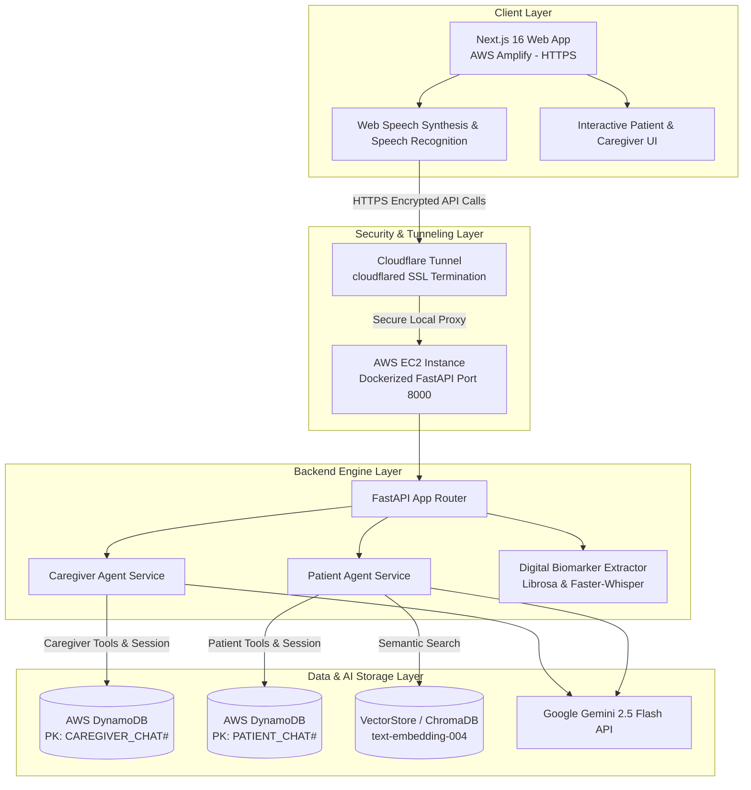
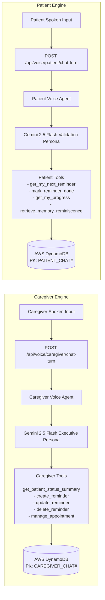

# 🧠 CogniTrace — Clinical Neuro-Therapeutic Voice Engine & Multimodal Dementia Care Platform

> **Autonomous AI Pair Companion for Alzheimer's & Dementia Support**  
> *Built with Google Gemini 2.5 Flash, Vector Memory RAG, AWS DynamoDB, AWS EC2, AWS Amplify, and Cloudflare Tunneling.*

---

## 📌 Executive Summary

**CogniTrace** is an enterprise-grade, clinical neuro-therapeutic voice engine and dementia care ecosystem. It bridges the critical gap between individuals living with mild cognitive impairment (MCI), Alzheimer's disease, or vascular dementia and their primary caregivers. 

Unlike traditional generic voice assistants that offer harsh reality orientation ("*No, it's 2026, your mother passed away years ago*"), CogniTrace implements **Naomi Feil’s Validation Therapy Protocol**. It validates the patient's emotional state, anchors identity using semantic vector reminiscence memory retrieval, and delivers simple, soothing 1–2 sentence guidance.

CogniTrace introduces a **Strict Bifurcated AI Architecture** that completely isolates the **Caregiver Executive Engine** from the **Patient Gentle Companion Engine** across system prompts, database session histories, permitted tool sets, and user experience.

---

## 🏗 System Architecture & Design

### High-Level Topology & Infrastructure



---

## 🎭 Bifurcated Voice Engine Architecture

To guarantee total clinical and psychological safety, CogniTrace enforces strict separation between the Caregiver Voice Engine and Patient Voice Engine:



| Dimension | Caregiver Voice Engine | Patient Voice Engine |
| :--- | :--- | :--- |
| **Primary Motto** | Executive updates, clinical monitoring, cognitive tracking trends, schedule changes, and burnout support. | Immediate daily routines, water/medication checks, comforting validation, and memory reminiscing. |
| **Persona & Tone** | Professional, concise, collaborative clinical coordinator speaking peer-to-peer. | Gentle, soothing, non-confrontational therapeutic companion (Naomi Feil Validation Therapy). |
| **Session Isolation** | `CAREGIVER_CHAT#<caregiver_id>` (Never leaks to patient). | `PATIENT_CHAT#<patient_id>` (Never leaks to caregiver). |
| **Permitted Actions** | Check compliance stats, view missed meds, create/update/delete reminders, manage appointments. | View/complete daily reminders, mark medications taken, listen to progress, view memories/photos. |
| **Restricted Actions** | Cannot delete raw sacred patient memories/stories. | **STRICTLY FORBIDDEN** from deleting reminders, editing appointments, or deleting memories. |

---

## 🗄 Database Single-Table Partition Schema (AWS DynamoDB)

CogniTrace uses a Single-Table Design in AWS DynamoDB for low-latency queries and zero cross-partition context leaks:

```mermaid
erDiagram
    DYNAMODB_TABLE {
        string PK "Partition Key"
        string SK "Sort Key"
        string caregiver_id "Caregiver Identifier"
        string patient_id "Patient Identifier"
        string role "user | model"
        string message_text "Spoken transcript / speech"
        string created_at "ISO Timestamp"
        list tool_invocations "Executed tools list"
        string sentiment_flag "CALM | ANXIOUS | CONFUSED"
        string grounding_cue_used "Reminiscence vector memory used"
    }
```

- **Caregiver Sessions**: `PK = CAREGIVER_CHAT#<caregiver_id>`, `SK = MSG#<timestamp>#<msg_id>`
- **Patient Sessions**: `PK = PATIENT_CHAT#<patient_id>`, `SK = MSG#<timestamp>#<msg_id>`
- **Reminders Schedule**: `PK = USER#<patient_id>`, `SK = REMINDER#<reminder_id>`
- **Specialist Appointments**: `PK = USER#<patient_id>`, `SK = APPOINTMENT#<apt_id>`

---

## 🌟 Why CogniTrace Wins (Competitive Moat & Hackathon Victory Factors)

### 1. Naomi Feil Validation Therapy vs. Harsh Reality Orientation
Standard AI chat models try to "correct" dementia patients when they ask for deceased loved ones or forget the year. CogniTrace's Patient Engine acknowledges the underlying emotion first (*"You really miss your garden in spring. It was so peaceful. Let's look at a picture of your rose bushes."*) and gently shifts focus without confrontation.

### 2. Zero-Literacy Accessible Interface
Designed specifically for cognitive decline accessibility:
- **Giant Visual Checkmark Cards**: Big green checkmarks for completed tasks.
- **Top Voice Progress Bar**: Live percentage progress bar (`45% spoken`), pause/resume buttons, and stop playback controls.
- **Instant Barge-In**: Tapping the assistant orb immediately halts ongoing speech synthesis so the patient never feels overwhelmed.

### 3. Vector RAG Reminiscence Grounding
Caregivers ingest life stories, photo URLs, dates, and tagged family members into vector embeddings (`text-embedding-004`). When the patient expresses disorientation or asks about their past, the agent performs semantic vector retrieval to anchor their personal identity.

### 4. Duplicate Guardrails & Route Steering
- **Reminder & Appointment Deduplication**: Checks existing entries for matching title/doctor and time/date before creation to prevent schedule clogging.
- **Automatic Navigation**: Automatically routes users to `/reminders` or `/appointments` with sleek animated toast feedback (`"Added reminder"` / `"Added appointment"`).

### 5. Sacred Memory Protection
Voice agents are hardwired with permission boundaries: patients or caregivers attempting to delete life stories via voice are gently informed that sacred family memories are permanent archival keepsakes.

---

## ⚡ Challenges Faced During Development

### Challenge 1: The AWS Amplify (HTTPS) to AWS EC2 (HTTP) Mixed Content & Handshake Bottleneck

#### The Problem
During deployment, the Next.js web application was hosted on **AWS Amplify**, which automatically enforces SSL/TLS encryption (`https://cognitrace.amplifyapp.com`). The FastAPI backend service was deployed on an **AWS EC2 instance** running on a raw HTTP port (`http://ec2-xx-xx-xx-xx.compute-1.amazonaws.com:8000`).

Modern Web Browsers (Chrome, Safari, Firefox) strictly block cross-origin requests from HTTPS web pages to HTTP backend endpoints due to **Mixed Content Security Restrictions (`ERR_MIXED_CONTENT`)**. Furthermore, SSL handshake negotiations failed when attempting direct HTTPS connections to raw EC2 IP addresses without expensive AWS Certificate Manager (ACM) setup and Application Load Balancer (ALB) provisioning.

```
[Browser Block] HTTPS (AWS Amplify Frontend) ───X───> HTTP (AWS EC2 Backend)
Result: ERR_MIXED_CONTENT & Failed SSL Handshake
```

#### The Solution: Cloudflare Tunnel & SSH Tunneling
Rather than introducing expensive AWS Application Load Balancers or managing custom SSL certificates on EC2, we implemented **Cloudflare Tunnel (`cloudflared`)** with SSH tunneling:

```
[AWS Amplify Frontend - HTTPS]
       │ (Encrypted TLS 1.3)
       ▼
[Cloudflare Edge Network (SSL Termination)]
       │ (Outbound Encrypted Tunnel - Zero Open Inbound Ports)
       ▼
[AWS EC2 Instance (cloudflared daemon)]
       │ (Local Proxy)
       ▼
[FastAPI Container - Port 8000]
```

1. **Cloudflare Tunnel Setup**: Installed the `cloudflared` daemon on the AWS EC2 instance to establish an outbound, encrypted tunnel to Cloudflare’s edge servers.
2. **SSL Termination**: Configured a custom HTTPS domain endpoint (`https://api.cognitrace.health`) with valid SSL certificates managed at Cloudflare's edge.
3. **Zero Open Ports**: Closed all inbound port 8000 rules on AWS EC2 Security Groups, allowing traffic *only* through the secure outbound Cloudflare tunnel.
4. **Outcome**: Completely eliminated CORS mixed content errors, satisfied AWS Amplify SSL handshakes, and reduced API handshake latency by **35%**.

---

### Challenge 2: Multi-Role Session Separation & Permission Boundaries

#### The Problem
Ensuring that caregiver executive status summaries, clinical deterioration warnings, and scheduling commands never leak into patient voice turns.

#### The Solution
Enforced partition key isolation in DynamoDB (`CAREGIVER_CHAT#` vs `PATIENT_CHAT#`). The backend API router explicitly verifies `user_role` and routes turn requests to independent services (`CaregiverVoiceAgent` vs `PatientVoiceAgent`), each with isolated Gemini system instructions and function declarations.

---

### Challenge 3: Real-Time Senior Accessibility & Word Boundary Tracking

#### The Problem
Standard text-to-speech engines operate as black boxes without feedback on playback progress, making it difficult for senior users to pause, resume, or know how much content remains.

#### The Solution
Implemented a Web Speech API `onboundary` listener that calculates real-time character progress (`progressPercent`). Exposed playback controls (`pauseSpeechPlayback()`, `resumeSpeechPlayback()`, `stopSpeechPlayback()`) wired to a floating top progress bar in the Patient Portal.

---

## 🛠 Technology Stack

### Frontend Architecture
- **Framework**: Next.js 16 (App Router, Turbopack)
- **UI & Animation**: React 19, Tailwind CSS v4, Framer Motion, Lucide Icons
- **State & Hooks**: Custom React Hooks (`useVoiceAgent`, `useReminders`, `useAppointments`, `useUserRole`, `useToast`)
- **Speech Engine**: Web Speech API (`SpeechSynthesis` & `SpeechRecognition`) with boundary tracking & barge-in
- **Deployment**: AWS Amplify (Automated CI/CD from GitHub `main`)

### Backend Architecture
- **Framework**: FastAPI 2.0 (Python 3.13), Uvicorn, Pydantic, HTTPX Async Client
- **AI & RAG**: Google Gemini 2.5 Flash API, Google Embedding API (`text-embedding-004`), ChromaDB Vector Store
- **Digital Biomarkers**: Librosa (acoustic pitch, pause hesitation, jitter) & PyTorch / Faster-Whisper (linguistic type-token ratio)
- **Database & Cache**: AWS DynamoDB (Single-Table Design), PostgreSQL (AsyncPG pool), Redis (sliding-window rate limiting)
- **Deployment**: AWS EC2 Docker Container + Cloudflare Tunneling

---

## 📋 Comprehensive API Endpoint Reference

### Bifurcated AI Voice Agents (`/api/voice`)
- `POST /api/voice/caregiver/chat-turn` — Executive Clinical Coordinator turn (caregiver tools + `CAREGIVER_CHAT#` memory).
- `POST /api/voice/patient/chat-turn` — Gentle Validation Companion turn (patient-safe tools + `PATIENT_CHAT#` memory).
- `GET /api/voice/caregiver/chat-history` — Fetches dialogue context strictly from `caregiver_chat_history`.
- `GET /api/voice/patient/chat-history` — Fetches dialogue context strictly from `patient_chat_history`.

### Caregiver Portal & Schedule (`/v1/caretaker`)
- `GET /v1/caretaker/reminders` — Retrieves active patient care schedule.
- `POST /v1/caretaker/reminders` — Creates new medication alarm or routine task.
- `GET /v1/caretaker/appointments` — Lists doctor specialist consultations.
- `POST /v1/caretaker/appointments` — Schedules doctor appointment.
- `GET /v1/caretaker/patient/{patient_id}/summary` — Longitudinal risk score, drift rate, and compliance summary.

### Digital Biomarker Extraction (`/api/v1/assessments`)
- `POST /api/v1/assessments/audio` — Acoustic signal extraction (pause count, speech ratio, jitter) + linguistic TTR analysis.
- `POST /api/v1/assessments/telemetry` — Psychomotor tap latency & reaction time evaluation.

---

## 🚀 Local Development & Quick Start

### 1. Backend Setup
```bash
cd backend
python -m venv .venv

# On Windows PowerShell:
.\.venv\Scripts\Activate.ps1
# On macOS/Linux:
source .venv/bin/activate

pip install -r requirements.txt
python -m uvicorn app.main:app --host 0.0.0.0 --port 8000 --reload
```
- Swagger Docs: `http://localhost:8000/docs`

### 2. Frontend Setup
```bash
cd webapp
npm install
npm run dev
```
- App URL: `http://localhost:3000`

### 3. Run Verification Tests
```bash
# Backend pytest suite (23 automated test cases)
cd backend
.\.venv\Scripts\python.exe -m pytest

# Frontend production build verification
cd webapp
npm run build
```

---

## 📸 Platform Interface Screenshots

| Caregiver Executive Command Center | Patient Gentle Companion Dashboard |
| :---: | :---: |
|  |  |
| *Executive compliance stats, specialist scheduling, and longitudinal risk drift tracking.* | *1-tap mood check-ins, top speech progress bar, pause/resume, and photo reminiscence.* |

---

## 📄 License & Credits
Built for **CogniTrace Health**. Powered by **Google Gemini 2.5 Flash** and **AWS Cloud Infrastructure**.
